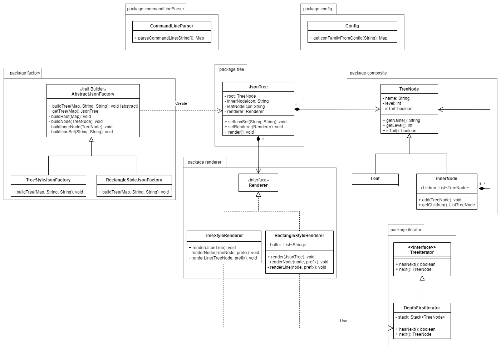
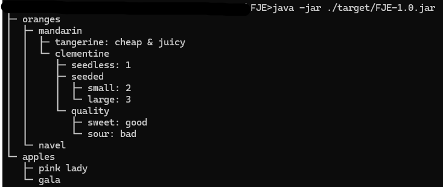
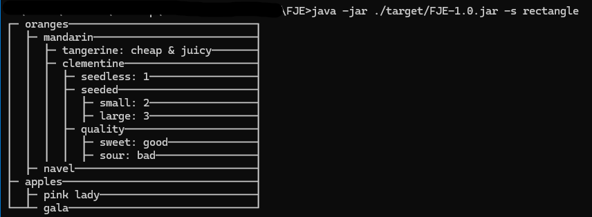
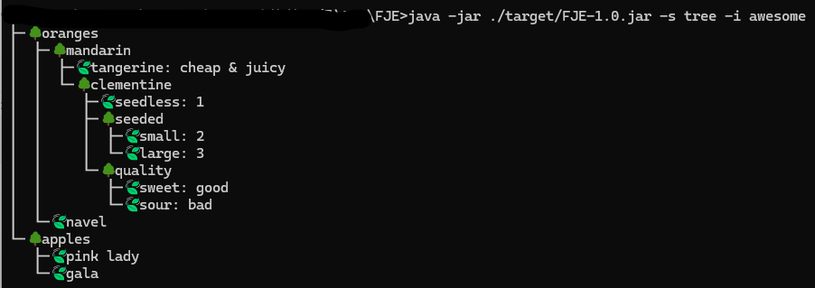
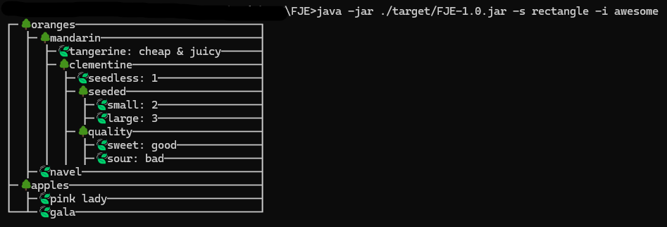

# FunnyJsonExplorer

## Configuration

下面是本机运行的配置：

* JDK 17
* Maven 3.9.6

## Usage

构建：

```bash
maven package
```

运行：

```bash
java -jar ./target/FJE-1.0.jar [-h] [-v] [-f filepath] [-s style] [-i iconfamily]
```

其中：

1. -h 显示帮助
2. -v 显示版本
3. -f 后指定文件路径，默认位于 `src/main/resources/data.json`
4. -s 后指定风格，可以选择 `tree` 和 `rectangle`，即树和矩形风格，默认风格为 `tree`。
5. -i 后指定图标集，预设了 `plain` 和 `awesome`，可以在 `src/main/resources/config.yaml` 中添加图标集，格式如下：

   ```
   IconFamily:
     iconfamilyname:
       InnerNodeIcon: " "
       LeafNodeIcon: " "
   ```

   其中 iconfamilyname 为自己指定的名字，InnerNodeIcon 和 LeafNodeIcon 后面添加想要的图标集。需要注意的是，这里的配置文件采用 UTF-8 编码，程序的所有输出也均为 UTF-8 编码。在终端中运行时需要将终端的字符集转换为 UTF-8 编码才能正确显示部分图标。

## Design

程序设计图如下：



其中：

* AbstractJsonFactory 及其继承类为工厂方法，AbstractJsonFactory 为抽象工厂，同时这些类也采用了建造者模式。
* TreeNode 及其继承类采用了组合模式。
* Renderer 及其实现类采用了策略模式，指定了渲染的风格，目的是将渲染的过程与树的信息解耦。
* TreeIterator 及其实现类采用了迭代器模式，迭代器模式使得在实现 Renderer 时不需要关注树的遍历方式，只需要关注本身的渲染逻辑。
* CommandLineParser 和 Config 类为工具类，分别用于读取命令行参数和图标集配置信息。
* 图中未展示主程序入口所在的类 `FunnyJsonExplorer`。

如果需要添加新的风格，不需要改变现有的代码，只需添加新的抽象工厂（继承 AbstractJsonFactory），并编写新的渲染类（继承 Renderer）即可。

## Example

对于 json 文件如下：

```
{
  "oranges": {
    "mandarin": {
      "clementine": {
        "seedless": 1,
        "seeded": {
          "small": 2,
          "large": 3
          },
        "quality": {
          "sweet": "good",
          "sour": "bad"
        }
      },
      "tangerine": "cheap & juicy"
    },
    "navel": null
  },
  "apples": {
    "gala": null,
    "pink lady": null
  }
}
```

下面是两种风格、两种图标族的运行结果。

<span>
    
    
    
    
</span>
